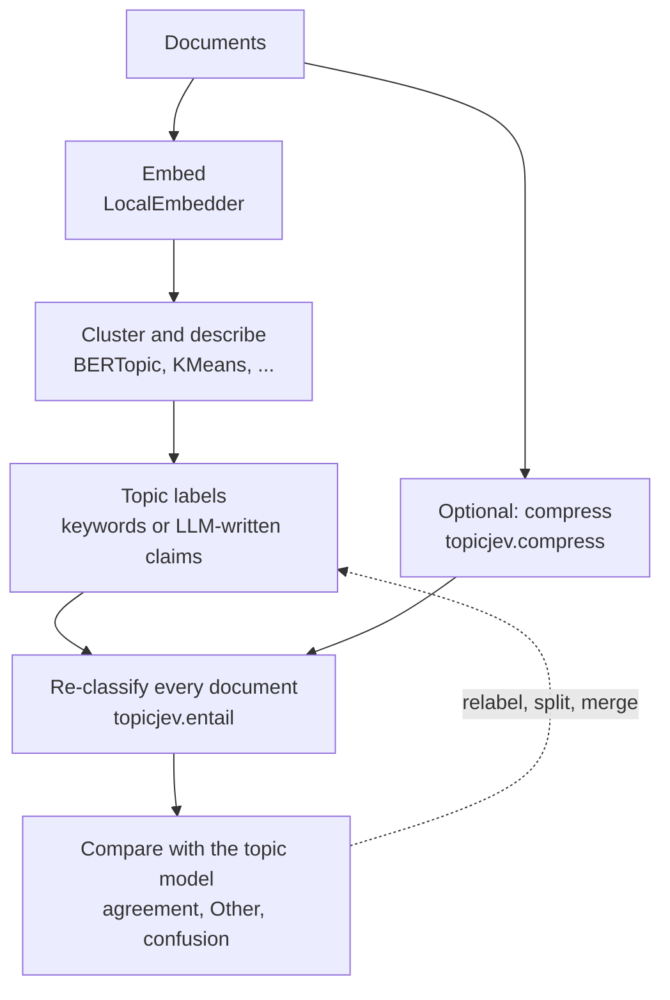
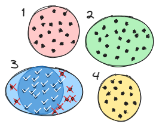

# How It Works

## The problem

A topic model such as BERTopic assigns every document to a topic and describes each topic with
keywords. It does not tell you whether a topic's description actually fits the documents in it.
Clusters are formed in embedding space, and the keywords are computed afterwards. A topic can be
geometrically tight and still be described by keywords that match only half of its documents, or it
can blend two themes that happen to sit close together.

Checking this usually means reading documents, labeling data by hand, or paying for many calls to
a hosted LLM.

## The bootstrap

TopicJev uses the topic model's own output as a zero-shot taxonomy, and lets an independent
classifier decide where each document belongs:

1. **Embed** the documents ([`LocalEmbedder`](getting_started/embeddings.md)).
2. **Cluster and describe** them with a topic model. TopicJev does not replace this step; the
   examples use [BERTopic](examples/bertopic_laya.md) and [plain KMeans](examples/kmeans_genlbs_laya.md).
3. **Turn each topic into a label**: its name and top keywords, or a short checkable claim and
   description written by an LLM ([`LocalGenerator`](getting_started/generation.md) with the
   [bundled prompts](getting_started/prompts.md)).
4. Optionally, **compress** long documents so the classifier sees their main point
   ([`topicjev.compress`](getting_started/compression.md)).
5. **Re-classify** every document against all topic labels with a zero-shot classifier
   ([`topicjev.entail`](getting_started/entailment.md)). The classifier never sees the embeddings
   or the clusters, only the text and the label descriptions.
6. **Compare** the two assignments.

<figure markdown>
  
  <figcaption>Every document is scored against all topic descriptions; this one, from cluster 2,
  scores 0.64 for its own topic. The documents that support their topic's description form the
  refined core (✓); the rest (✗) are flagged as outliers or routed to <em>Other</em>.</figcaption>
</figure>

## Reading the comparison

The comparison gives three label-free signals per topic:

**Agreement**
:   The share of a topic's documents that the classifier puts back into the same topic. High
    agreement means the description explains the documents; low agreement means it does not.

**Other**
:   Documents the classifier assigns to *none* of the topics, because no label was convincing
    enough or a [decoy](getting_started/entailment.md#decoys) won. A large share points to topics
    whose descriptions are too thin or too narrow.

**Where documents go**
:   A cross-tabulation of topic against class shows *which* topics absorb another topic's documents:
    a sign of overlapping descriptions, or of a topic that should be split.

[BERTopic + Laya](examples/bertopic_laya.md#reading-the-results) walks through these signals on a
real run, and checks them against the gold labels of AG News.

Possible next steps, depending on what the signals show:

- **Relabel** topics with low agreement, for example with an LLM-written title and description,
  and check again.
- **Split** a topic whose documents scatter over several classes; **merge** topics that trade
  documents with each other.
- **Keep the core**: treat the documents that both the topic model and the classifier agree on as
  high-confidence members of the topic, for example as seed examples for a classifier.

## Why an entailment check

The topic model and the classifier look at different evidence. The topic model groups documents by
embedding similarity; the zero-shot classifier only reads the text and a human-readable label. When
both agree, the label describes its documents in a way that a separate model can verify. When they
disagree, either the cluster or its description needs attention.

Because the classifier only needs label text, the check needs no training data. TopicJev's
backends run on local models, from small NLI cross-encoders and ModernBERT decision encoders to
instruction-tuned LLMs; the [examples](examples/bertopic_laya.md) run on a laptop.

## How a document is scored

Each classifier turns (document, label) pairs into scores, and TopicJev applies the same
calibration to all of them:

\[
p(l \mid d) = \operatorname{softmax}_l\!\left(\frac{s(d, l) - \frac{1}{|P|}\sum_{p \in P} s(p, l)}{T}\right)
\]

where \(s\) is the backend's raw score, \(P\) the optional [probe](getting_started/entailment.md#probes)
texts and \(T\) the temperature. The top label is accepted if \(p > 2/N\) for \(N\) labels, and the
document is *Other* otherwise. Details are in
[Scoring and calibration](getting_started/entailment.md#scoring-and-calibration).
