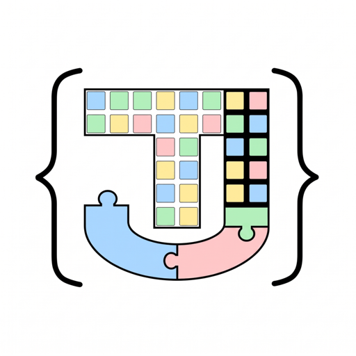
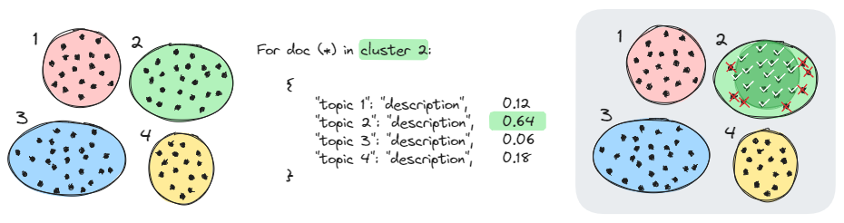

# TopicJev



**An Efficient Low-Resource Bootstrap for Topic Model Refinement in Zero-Shot Settings**

Dense embedding models and clustering algorithms for topic modeling group documents by similarity
or geometry. As clusters grow, they absorb documents that are only superficially related. Without
ground-truth labels, validating these groupings requires expensive manual audits or costly calls to
hosted LLMs.

**TopicJev** assesses and refines the alignment of a topic model. It expresses each topic as a
label (its keywords, or a short generated claim such as *"The text discusses…"*) and runs a
zero-shot entailment model against the resulting schema. Because it only needs the topic model's
output, almost any topic model, such as [BERTopic](https://maartengr.github.io/BERTopic/) or
k-means, can be cross-checked. Documents that support their label form the topic's refined core;
the rest are flagged as outliers or routed to *Other* instead of silently diluting the topic.



A new class of classification models, called "System One" by [TypeSafe AI](https://typesafe.ai/),
has drawn interest for its low cost and fast inference. Before
[Jev](https://typesafe.ai/blog/introducing-system-one-models-and-jev), zero-shot entailment methods
(e.g. NLI with *entailment*, *neutral* and *contradiction* classes) were the basis of
hypothesis-driven classification. Open-source models such as
[Laya](https://github.com/NandhaKishorM/laya) now mirror the capabilities of System One
architectures. TopicJev uses foundation models and their lightweight counterparts to improve
representation, verification and alignment in existing topic modeling frameworks, on low-resource
machines.

## Why TopicJev?

TopicJev is designed for cases where cluster quality matters, but labeled data and large compute
budgets are not available:

- **Auditing and refining topic models:** post-process the output of existing frameworks to purge
  false positives and compute agreement metrics without ground-truth labels.
- **Zero-shot taxonomy routing:** classify unannotated corpora into your own categories, with
  automatic routing to an *Other* class when confidence falls below the threshold.
- **Low-resource and privacy-preserving:** runs locally on consumer GPUs, Apple Silicon (MPS) or the
  CPU, with compact models (ModernBERT decision encoders, cross-encoders, small language models),
  without API fees or rate limits.
- **Long documents:** built-in document compression (LLMLingua-2 token pruning or causal
  summarization) fits long texts into small context windows.

## Core modules

<div class="grid cards" markdown>

-   :material-check-decagram-outline:{ .lg .middle } **`topicjev.entail`**

    ---

    Zero-shot entailment and topic verification: the Laya ModernBERT decision model, causal LMs,
    NLI cross-encoders, and the hosted TypeSafe Jev API.

    [:octicons-arrow-right-24: Zero-shot classification](getting_started/entailment.md)

-   :material-arrow-collapse-horizontal:{ .lg .middle } **`topicjev.compress`**

    ---

    Condense long texts before clustering or verification: LLMLingua-2 token pruning, or
    length-scaled summaries with causal and seq2seq models.

    [:octicons-arrow-right-24: Compression](getting_started/compression.md)

-   :material-scatter-plot-outline:{ .lg .middle } **`topicjev.gen`**

    ---

    Dense embeddings with FAISS indexing and caching, and schema-constrained JSON generation with
    local LLMs and automatic retries.

    [:octicons-arrow-right-24: Embeddings](getting_started/embeddings.md) ·
    [LLM generation](getting_started/generation.md)

-   :material-text-box-outline:{ .lg .middle } **`topicjev.prompts`**

    ---

    Bundled prompt templates that turn a cluster's documents into a title, summary and keywords,
    and then into a class name that an entailment model can check.

    [:octicons-arrow-right-24: Prompt templates](getting_started/prompts.md)

</div>

## Installation

TopicJev needs Python 3.12 or newer. Install it from source, with all optional backends and the
dependencies of the examples:

```bash
git clone https://github.com/anatems1/TopicJev.git
cd TopicJev
pip install -e ".[all]"
```

On a Windows or Linux machine with an NVIDIA GPU, install the CUDA build of PyTorch instead; see
[Installation](getting_started/installation.md#nvidia-gpu-windows-linux).

## Quick Start

Check documents against the topic keywords (or generated claims) found by your topic model, and
route outliers to *Other*:

```python
import json
from topicjev.entail import LayaEntail

# Public feedback on roadway conditions
docs = [
    "Huge deep pothole on the right lane of I-80 eastbound near exit 15, nearly blew my tire out.",
    "Oak Street is closed off to all thru traffic between Maple and Pine for emergency bridge repair.",
    "Massive congestion on inbound Parkway East this morning, stop-and-go delays for over 4 miles.",
    "The new LED streetlights on Elm Street are too dim and flickering at night.",  # Outlier
]

# Simulated topic model results (topic name -> discovered keywords)
topics = {
    "pothole": "pothole, crater, asphalt damage, rim damage, blown tire, pavement defect",
    "road closure": "road closure, detour, closed, barricades, impassable, blocked, repair",
    "congestion": "congestion, traffic, gridlock, bottleneck, delays, stop and go, backup",
}

# Encode topics as Jev decision criteria (JSON)
topic_labels = [json.dumps({topic: desc}) for topic, desc in topics.items()]
topic_names = list(topics.keys())

# Laya ModernBERT decision encoder
model = LayaEntail("convaiinnovations/laya-typed-decisions")
with model:
    results = model.entail(docs=docs, lbls=topic_labels)

for doc, res in zip(docs, results):
    assigned = res["class"]
    prob = res["prob"]
    if assigned < len(topic_names):
        print(f"[{topic_names[assigned].upper():<12}] (prob: {prob:.2f}) -> '{doc[:55]}...'")
    else:
        # Out-of-domain documents are routed to 'Other' instead of diluting the clusters
        print(f"[{'OUTLIER/OTHER':<12}] (prob: {prob:.2f}) -> '{doc[:55]}...'")
```

```text
[POTHOLE     ] (prob: 0.72) -> 'Huge deep pothole on the right lane of I-80 eastbound n...'
[ROAD CLOSURE] (prob: 0.75) -> 'Oak Street is closed off to all thru traffic between Ma...'
[CONGESTION  ] (prob: 0.91) -> 'Massive congestion on inbound Parkway East this morning...'
[OUTLIER/OTHER] (prob: 0.65) -> 'The new LED streetlights on Elm Street are too dim and ...'
```

Each result holds the index of the winning label (`class`), its probability (`prob`) and the
probabilities of all labels (`probs`), for example
`{"class": 0, "prob": 0.7239, "other": None, "probs": [0.7239, 0.0812, 0.0750]}`. A document that
fits none of the labels gets `class == len(labels)`, meaning *Other*.

## End-to-end examples

Two complete, reproducible workflows run on a 1,500-document slice of
[AG News](https://huggingface.co/datasets/fancyzhx/ag_news):

- **[BERTopic + Laya](examples/bertopic_laya.md)** (`examples/bertopic_laya.py`): fits BERTopic
  (UMAP + KMeans + c-TF-IDF), turns each topic's keywords into decision criteria, and uses
  `LayaEntail` to verify every document's assignment and compute topic agreement rates.
- **[KMeans + LLM labels + Laya](examples/kmeans_genlbs_laya.md)** (`examples/kmeans_genlbs_laya.py`):
  a lightweight pipeline without BERTopic. It clusters the embeddings with KMeans, retrieves the five
  documents nearest each centroid from the FAISS index, and has a local `Qwen3-1.7B` write a
  checkable topic label through the `reduce` → `classes` prompt chain before running `LayaEntail`.

## Choosing a classifier

| Backend | Model family | Good for |
| :--- | :--- | :--- |
| [`LayaEntail`](getting_started/entailment.md#layaentail-and-jeventail) | Local Laya ModernBERT decision model | Topics described by a name plus keywords or a description; single-label decisions with a built-in *Other* option. |
| [`XEncoderEntail`](getting_started/entailment.md#xencoderentail) | NLI cross-encoder (DeBERTa) | Checking short claims such as "The text discusses ..."; small and fast. |
| [`GoalExEntail`](getting_started/entailment.md#goalexentail) | Encoder-decoder (FLAN-T5) | Yes/No property checks without generation. |
| [`CausalEntail`](getting_started/entailment.md#causalentail) | Causal chat LM (Qwen, Llama, ...) | The same Yes/No check with a modern instruction-tuned LLM. |
| [`Seq2SeqEntail`](getting_started/entailment.md#seq2seqentail) | Encoder-decoder (FLAN-T5) | Scoring label names by their likelihood as a completion. |
| [`JevEntail`](getting_started/entailment.md#layaentail-and-jeventail) | Hosted TypeSafe API | The Laya-style decision without local compute. |

## Current limitations and research status

TopicJev is an active research project and a work in progress:

- **Zero-shot confidence calibration:** for the local decision models (e.g. Laya) and the hosted
  TypeSafe Jev model, confidence calibration has not been fine-tuned. Assignments are truly
  zero-shot, decided by the top category and decoy routing; treat the confidence scores as
  uncalibrated indicators, not as calibrated posterior probabilities.
- **Hosted API batch scaling:** high-volume batching of large document collections has not yet been
  evaluated with the remote TypeSafe API. Experiment with local models first, before moving to the
  hosted endpoint for comparisons.
- **Ongoing benchmarks:** formal evaluations and quantitative benchmarks on standard topic modeling
  datasets are underway and will be reported in an upcoming release.

## Acknowledgements

TopicJev builds upon and integrates ideas from:

- [TypeSafe AI and Jev](https://typesafe.ai/blog/introducing-system-one-models-and-jev) for System
  One decision formulations;
- [Laya](https://github.com/NandhaKishorM/laya) for open-source ModernBERT decision architectures;
- [GoalEx](https://arxiv.org/abs/2305.13749) for target token logit extraction;
- [LLMLingua](https://github.com/microsoft/LLMLingua) for prompt and document token compression.

## License

TopicJev is released under the [MIT License](https://github.com/anatems1/TopicJev/blob/master/LICENSE.md).
